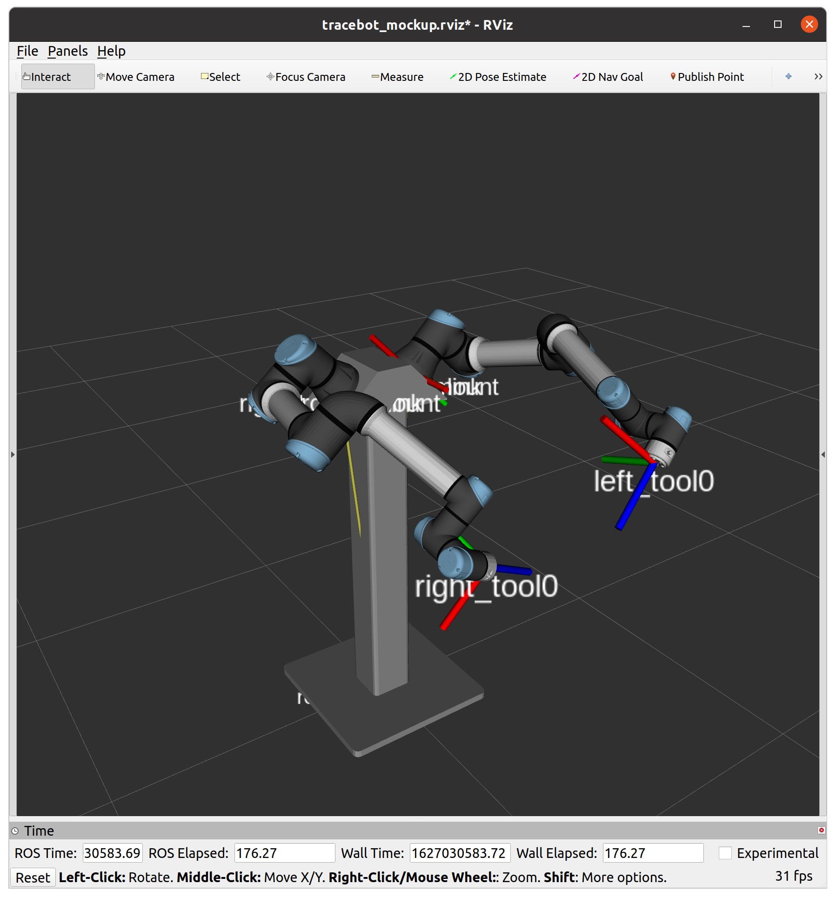

# Tracebot Mockup


This repository contains ROS packages to run a simulated mockup of the Tracebot setup in Rviz and Gazebo.
The objective is to analyse different placements of the robots and equipment in regard to reachability and manipulability.



## Table of Contents

- [Model Parameters](#model-parameters)
- [Usage](#usage)
  - [Launch Rviz](#launch-rviz)
  - [Launch Gazebo](#launch-gazebo)
- [Setup](#setup)
  - [Installing locally](#installing-locally)
  - [Using docker images](#using-docker-images)


## Model Parameters

The URDF model contained in `tracebot_mockup_description` is parametrized using xacro.
The table below lists the available parameters and their meaning.

| Parameter name | Description |
| -------------- | ----------- |
| `arm_mount_offset_x` | Offset in X direction of the robot arm with respect to the center of the stand. |
| `arm_mount_offset_y` | Offset in Y direction of the robot arm with respect to the center of the stand. |
| `arm_mount_offset_z` | Offset in Z direction of the robot arm with respect to the top of the stand. |
| `arm_mount_offset_theta` | Rotational offset around Z of the robot arm with respect to the center of the stand. |
| `mount_base_height` | Height of the robot stand. |
| `mount_base_length` | Length of the robot stand. |
| `mount_base_width` | Width of the robot stand. |
| `arm_base_tilt` | Angular upward tilt of the robot bases. |
| `left_arm_model` | Model used for left Robot Arm. Must use on of: (ur3, ur3e, ur5, ur5e, ur10, ur10e, ur16e)|
| `right_arm_model` | Model used for right Robot Arm. Must use on of:  (ur3, ur3e, ur5, ur5e, ur10, ur10e, ur16e)|

All parameters use SI units.

## Usage
### Launch Rviz
This repository offers visualisation of the mockup model within rviz using the `view_tracebot_mockup.launch` file, inside `tracebot_mockup_description`.

The rviz simulation give a basic visualisation of the robot with any of the robot arms (the default being ur5e). The launchfile exposes the parameters listed in [Model Parameters](#model-parameters) as arguments, providing reasonable defaults.

Firsly ensuring that the workspace is sourced:
```bash
source ~/path/to/tracebot_mockup_ws/devel/setup.bash
```
- The mockup can be run with default parameters:
```bash
roslaunch tracebot_mockup_description view_tracebot_mockup.launch
```
- Or using any of the available parameters, such as exchanging the left arm for the ur10e model:
```bash
roslaunch tracebot_mockup_description view_tracebot_mockup.launch left_arm:="ur10e"
```

A camera view can be added to rviz:

```bash
roslaunch tracebot_mockup_description camera_display.launch
```

The intrinsic camera parameters are defined using the standard ROS format, and stored in [head_camera.yaml](tracebot_mockup_description/config/head_camera.yaml).
The pose of the camera in the world is defined within the launchfile [camera_display.launch](tracebot_mockup_description/launch/camera_display.launch)

### Launch Gazebo
| Parameter name | Description |
| -------------- | ----------- |
|`controller_config_file`|`Config file used for defining the ROS-Control controllers.`|
|`controllers`|`Controllers that are activated by default.`|
|`stopped_controllers`|`Controllers that are initally loaded, but not started.`|
|`tf_prefix`|`tf_prefix used for the robot.`|
|`tf_pub_rate`|`Rate at which robot_state_publisher should publish transforms.`|
|`paused`|`Starts Gazebo in paused mode`|
|`gui`|`Starts Gazebo gui`|

As shown above, the gazebo launch file has some additional parameters that can be set. However any of the previously stated parameters can also be used.

- This can be launched with the default using:
```bash
roslaunch tracebot_mockup_gazebo view_tracebot_mockup.launch view_tracebot_gazebo.launch
```
- Or using any of the available parameters, such as starting the simulation paused:
```bash
roslaunch tracebot_mockup_description view_tracebot_mockup.launch paused:=true
```
The arms can then be communicated with by publishing to the `/pos_joint_traj_controller/command` topic which uses [JointTrajectory messages](http://docs.ros.org/en/noetic/api/trajectory_msgs/html/msg/JointTrajectory.html). An example of this can be found in the [scripts/gazebo_model_test.py](tracebot_mockup_gazebo/scripts/gazebo_model_test.py) file.
To run this, and test that the gazebo simulation is working, run:
```bash
rosrun tracebot_mockup_gazebo gazebo_model_test.py
```
You should see that all the motors trigger and the arms curl up.

## Setup

There's two different possibilities to use the packages in this repository: installing locally or running the pre-built docker images.

### Installing locally

These packages are known to support ROS Melodic and Noetic, although other distros may be supported as well.

The packages can be built/installed following standard ROS-based procedures.
The examples listed below use [catkin_tools](https://catkin-tools.readthedocs.io) as build tool, although `catkin_make` and `catkin_make_isolated` _should_ be also supported:

- Create a workspace:
  ```bash
  mkdir -p ~/path/to/tracebot_mockup_ws/src
  cd ~/path/to/tracebot_mockup_ws
  catkin config --extend /opt/ros/"$ROS_DISTRO"
  ```
- Pull the packages into the repository:
  ```bash
  cd ~/path/to/tracebot_mockup_ws/src
  git clone https://gitlab.com/tracebot/tracebot_mockup.git
  ```
- Certain dependencies are not released as binary packages to either Melodic or Noetic, pull those into the workspace as well:
  ```bash
  cd ~/path/to/tracebot_mockup_ws/src
  vcs import < tracebot_mockup/upstream.repos # Install python(3)-vcstool if not available
  ```
- Install the rest of dependencies from binary repositories
  ```bash
  cd ~/path/to/tracebot_mockup_ws
  rosdep install -iy --from-paths src --rosdistro "$ROS_DISTRO"
  ```
- Build:
  ```bash
  cd ~/path/to/tracebot_mockup_ws
  catkin build
  ```

### Using docker images

The `miguelprada/tracebot_mockup:noetic` docker image with the mockup packages pre-installed is periodically built and made available through DockerHub.

The recommended way to run this image is using the [osrf/rocker](https://github.com/osrf/rocker) tool.
This is a small wrapper tool around the docker CLI which facilitates tasks such as enabling X11 forwarding (required to view the simulated scene in rviz).

The mockup with default parameters can be run using rocker with:

```bash
rocker --x11 -- miguelprada/tracebot_mockup:noetic roslaunch tracebot_mockup_description view_tracebot_mockup.launch
```

Note that if your system runs NVidia graphics, you may need to use:

```bash
rocker --x11 --nvidia -- miguelprada/tracebot_mockup:noetic roslaunch tracebot_mockup_description view_tracebot_mockup.launch
```

Alternatively, instructions to enable X11 forwarding in docker in different ways can be found in [this page](http://wiki.ros.org/docker/Tutorials/GUI).
