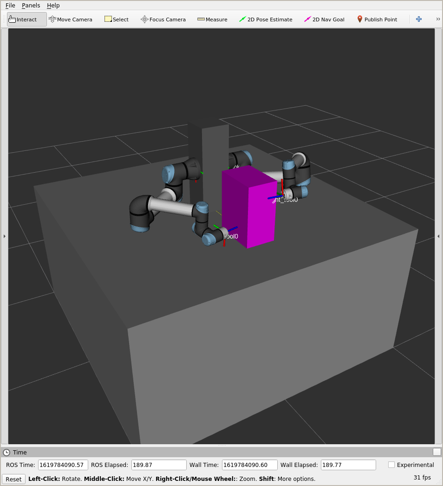

# Tracebot Mockup

This repository contains ROS packages to run a simulated mockup of the Tracebot setup.
The objective is to analyse different placements of the robots and equipment in regard to reachability and manipulability.



## Table of Contents

- [Model Parameters](#model-parameters)
- [Usage](#usage)
- [Setup](#setup)
  - [Installing locally](#installing-locally)
  - [Using docker images](#using-docker-images)

## Model Parameters

The URDF model contained in `tracebot_mockup_description` is parametrized using xacro.
The table below lists the available parameters and their meaning.

| Parameter name | Description |
| -------------- | ----------- |
| `table_height` | Height of the box representing the table. | 
| `table_length` | Length of the box representing the table. |
| `table_width` | Width of the box representing the table. |
| `robot_mount_offset_x` | Offset in X direction of the robot mount block with respect to the center of the table. |
| `robot_mount_offset_y` | Offset in Y direction of the robot mount block with respect to the center of the table. |
| `robot_mount_offset_theta` | Rotational offset around Z of the robot mount block with respect to the center of the table. |
| `robot_mount_height` | Height of the robot mount block. |
| `robot_mount_length` | Length of the robot mount block. |
| `robot_mount_width` | Width of the robot mount block. |
| `robot_base_tilt` | Angular upward tilt of the robot bases. |
| `pump_offset_x` | Offset in X direction of the block representing the pump with respect to the center of the table. |
| `pump_offset_y` | Offset in Y direction of the block representing the pump with respect to the center of the table. |
| `pump_offset_theta` | Rotational offset around Z of the block representing the pump with respect to the center of the table. |
| `pump_height` | Height of the block representing the pump. |
| `pump_length` | Length of the block representing the pump. |
| `pump_width` | Width of the block representing the pump. |

All parameters use SI units.

## Usage

Currently this repository offers the `view_tracebot_mockup.launch` file, inside `tracebot_mockup_description` to visualize the mockup model using rviz.

This launchfile exposes the parameters listed in [Model Parameters](#model-parameters) as arguments, providing reasonable defaults.
For instance, to visualize the model with a 30 degree tilt of the robot bases, run:

```bash
roslaunch tracebot_mockup_description view_tracebot_mockup.launch robot_base_tilt:=0.5236
```

## Setup

There's two different possibilities to use the packages in this repository: installing locally or running the pre-built docker images.

### Installing locally

These packages are known to support ROS Melodic and Noetic, although other distros may be supported as well.

The packages can be built/installed following standard ROS-based procedures.
The examples listed below use [catkin_tools](https://catkin-tools.readthedocs.io) as build tool, although `catkin_make` and `catkin_make_isolated` _should_ be also supported:

- Create a workspace:
  ```bash
  mkdir -p ~/path/to/tracebot_mockup_ws/src
  cd ~/path/to/tracebot_mockup_ws
  catkin config --extend /opt/ros/"$ROS_DISTRO"
  ```
- Pull the packages into the repository:
  ```bash
  cd ~/path/to/tracebot_mockup_ws/src
  git clone https://github.com/tecnalia-medical-robotics/tracebot_mockup.git
  ```
- Certain dependencies are not released as binary packages to either Melodic or Noetic, pull those into the workspace as well:
  ```bash
  cd ~/path/to/tracebot_mockup_ws/src
  vcs import < tracebot_mockup/upstream.repos # Install python(3)-vcstool if not available
  ```
- Install the rest of dependencies from binary repositories
  ```bash
  cd ~/path/to/tracebot_mockup_ws
  rosdep install -iy --from-paths src --rosdistro "$ROS_DISTRO"
  ```
- Build:
  ```bash
  cd ~/path/to/tracebot_mockup_ws
  catkin build
  ```
- Run mockup with default parameters:
  ```bash
  source ~/path/to/tracebot_mockup_ws/devel/setup.bash
  roslaunch tracebot_mockup_description view_tracebot_mockup.launch
  ```

### Using docker images

The `miguelprada/tracebot_mockup:noetic` docker image with the mockup packages pre-installed is periodically built and made available through DockerHub.

The recommended way to run this image is using the [osrf/rocker](https://github.com/osrf/rocker) tool.
This is a small wrapper tool around the docker CLI which facilitates tasks such as enabling X11 forwarding (required to view the simulated scene in rviz).

The mockup with default parameters can be run using rocker with:

```bash
rocker --x11 -- miguelprada/tracebot_mockup:noetic roslaunch tracebot_mockup_description view_tracebot_mockup.launch
```

Alternatively, instructions to enable X11 forwarding in docker in different ways can be found in [this page](http://wiki.ros.org/docker/Tutorials/GUI).
